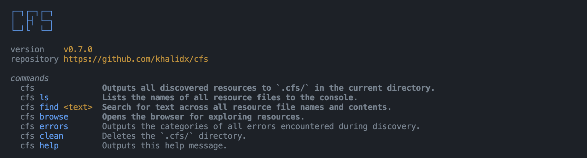
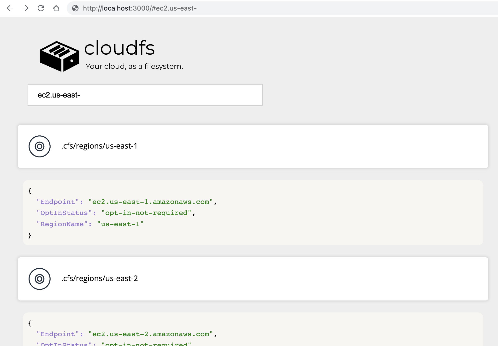

# cfs


An easy way to discover and manage your cloud like a local filesystem.

The swiss army knife for *finding any resource* in your AWS account.

[](https://www.npmjs.com/package/@khalidx/cfs)
[](https://github.com/khalidx/cfs/blob/main/LICENSE)
[](https://github.com/khalidx/cfs/commits/main)
[](https://github.com/khalidx/cfs/actions/workflows/build.yml)
[](https://snyk.io/test/github/khalidx/cfs)

## ⏬ install

```sh
npm install -g @khalidx/cfs
```

Also, a native binary is available for [Windows](https://github.com/khalidx/cfs/releases/download/v0.7.0/cfs-win.exe), [Mac](https://github.com/khalidx/cfs/releases/download/v0.7.0/cfs-macos), and [Linux](https://github.com/khalidx/cfs/releases/download/v0.7.0/cfs-linux).

Need help using this application? [Read this](#support).



## introduction

Or, "why do I need this application?".

If you're like me, you spend countless hours working with cloud resources, like S3 buckets and EC2 instances.

Sometimes, you just want to be able to see [*ALL* the resources](#supported-resources) in your AWS account. Especially when starting a new job or taking inventory of what's in your cloud.

Searching for a specific resource or across resources is usually a sub-par experience in most cloud consoles.

When you are searching for something specific, and would rather have all your resources as files locally, so that you can search through them and process them with other tools, reach for `cfs`.

`cfs` exports all your cloud resources as JSON files.

## table of contents

- [cfs](#cfs)
  - [⏬ install](#-install)
  - [introduction](#introduction)
  - [table of contents](#table-of-contents)
  - [usage](#usage)
    - [cli](#cli)
    - [discovering resources](#discovering-resources)
    - [updating resources](#updating-resources)
    - [troubleshooting](#troubleshooting)
    - [aws credentials](#aws-credentials)
    - [supported resources](#supported-resources)
  - [plugins](#plugins)
    - [plugin resolution](#plugin-resolution)
    - [plugins file](#plugins-file)
  - [developers](#developers)
  - [support](#support)

## usage

### cli

```sh
cfs
cfs ls
cfs find
cfs browse
cfs errors
cfs clean
cfs help
```

> Make sure you're [logged in to AWS](#aws-credentials) before running the commands above.

### discovering resources

```sh
cfs
```

Running the command above outputs all [discovered resources](#supported-resources) to `.cfs/` in the current directory.

Optionally, pass `--region` to limit discovery to a single region, like `cfs --region us-east-1`.

```sh
cfs ls
```

Running the command above lists the names of all resource files to the console. This is useful for passing the output to other tools, like `grep`.

For example, for viewing "vpc" resources only (searching file names):

```sh
cfs ls | grep vpc
```

Or, for viewing any resource with "us-east-1" in its configuration file (searching file contents):

```sh
cfs ls | xargs grep -l us-east-1
```

Of course, you could also use the built-in search in your favorite IDE (like VSCode) or open and browse the files directly!

You can also search cloud resource files (their file names and contents) with `cfs find`, like so:

```sh
cfs find "m5.large"
```

Another cool option is being able to explore all your resources in a web browser, complete with full-text search! The following command starts up a server and opens your web browser so you can start exploring:

```sh
cfs browse
```

The command above opens the following attractive experience for searching your resources. It runs on `localhost`, and your data stays local and never leaves your device.



To remove all downloaded resources from the local filesystem (without affecting anything in your cloud account), run:

```sh
cfs clean
```

This is the same as deleting the `.cfs/` directory yourself with `rm -rf .cfs/`.

### updating resources

(coming soon)

### troubleshooting

If you encounter any errors while [discovering resources](#discovering-resources) using the `cfs` command, there are three things you can do right off the bat.

1. Check the `.cfs/errors.log` file
2. Run the `cfs errors` command, which will output the categories of all errors encountered during resource discovery
3. Submit a GitHub issue ([we close issues pretty fast!](#support))

### aws credentials

Make sure you're logged in to AWS, and have the corresponding credentials file or environment variables set. Otherwise, `cfs` won't be able to query your cloud resources.

Here's a quick guide from AWS on [configuring your credentials with the AWS CLI](https://docs.aws.amazon.com/cli/latest/userguide/cli-configure-quickstart.html#cli-configure-quickstart-config).

### supported resources

The following cloud resources are [currently supported](./src/resources/):

- AWS CloudWatch Metric Alarms
- AWS CloudWatch Composite Alarms
- AWS API Gateway HTTP APIs
- AWS API Gateway REST APIs
- AWS S3 Buckets
- AWS CloudWatch Synthetics Canaries
- AWS ACM Certificates
- AWS CloudFront Distributions
- AWS Route53 Hosted Zones
- AWS ELB Classic Load Balancers
- AWS ELB Application, Gateway, and Network Load Balancers
- AWS Lambda Functions
- AWS EC2 Instances
- AWS SSM Parameters
- AWS CodePipeline Pipelines
- AWS SQS Queues
- AWS Regions
- AWS CloudFormation Stacks
- AWS Kinesis Streams
- AWS DynamoDB Tables
- AWS SNS Topics
- AWS VPCs

More resources are coming soon, with the goal of covering all resources listed on the [AWS resource and property types reference](https://docs.aws.amazon.com/AWSCloudFormation/latest/UserGuide/aws-template-resource-type-ref.html) page.

## plugins

`cfs` now supports plugins! What can you do with plugins?

Do something after resources are discovered and saved, like:

- [warning if any S3 buckets are public](.cfs/plugins/examples/no-public-buckets.ts)
- enriching the resource with information from another API, like [fetching more information about queues](.cfs/plugins/examples/enriched-queue-info.ts)

Plugins are defined in `.cfs/plugins/plugins.yaml`, and can be written in any language and can run any application. Check the [example plugins](.cfs/plugins/examples/) directory in this repository for ideas.

Plugins run in the current directory by default, the same directory that contains the `.cfs/` subdirectory.

### plugin resolution

The plugins feature is enabled or disabled based on the following rules:

- The presence of the `CFS_DISABLE_PLUGINS` environment variable
- The presence of a `.cfs/plugins/plugins.json` file
- The presence of a `.cfs/plugins/plugins.yaml` file
- The presence of a `.cfs/plugins/plugins.yml` file
- The presence of a `disabled` flag in the plugins file

Individual plugins run based on the order they are defined in the plugins file, and on the following rules:

- The presense of the `disabled` flag for the specific plugin in the plugins file
- If a plugin ends with `.js`, it runs with `node`
- If a plugin ends with `.ts`, it runs with `npx ts-node`
- Otherwise, it is started with a `bash` command, enabling you to run any CLI command, process, or script

### plugins file

The plugins file contains a simple syntax. Here are some examples:

- a TypeScript plugin, defined inline

    ```yaml
    plugins:
    - ./examples/no-public-buckets.ts
    ```

- the same TypeScript plugin, defined as an object, and marked as disabled

    ```yaml
    plugins:
    - disabled: true
      run: ./examples/no-public-buckets.ts
      description: Logs the names of any buckets that are public
    ```
- a plugin that spawns a shell command, defined inline

    ```yaml
    plugins:
    - ls -al .cfs/
    ```

## developers

This section is for developers working on the `cfs` code. If you are instead looking for usage instructions, see the sections above.

After cloning, run `npm link` to make the `cfs` CLI available. You can now edit the TypeScript source files, and whenever you run `cfs` you'll be working with the latest sources directly, without having to build/compile the TypeScript files.

## support

🚀 Over the **next week** (April 18-25 2022), all GitHub issues submitted will receive an 8-hour turnaround time, for a good beta testing experience!
